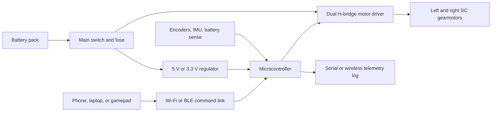

# RC Car Robotics Starter Plan

## Project Summary

Build a small programmable RC car that can be driven manually from a phone, laptop, or gamepad, while also collecting enough telemetry to teach real robotics habits. The first successful version should be boring in the best way: it turns, drives, stops safely, survives repeated tests, and leaves behind wiring notes, calibration data, and a short demo video.

The learning goal is not just "make a car move." The goal is to learn the system tradeoffs behind mobile robots: chassis design, power, motor drivers, embedded control, wireless commands, sensing, debugging, and documentation.

## Recommended Scope

Start with a 2WD differential-drive robot car unless the specific learning goal is car-like steering geometry. Differential drive is easier to build, easier to control, and maps directly into many robotics topics such as odometry, PID speed control, and ROS 2 mobile robot models.

Use Ackermann steering as the first major extension if you want the project to feel more like a hobby-grade RC car. That version adds steering geometry, a servo, turning radius constraints, and more interesting vehicle dynamics.

## Success Criteria

- The car can be driven forward, backward, left, and right from a wireless controller.
- A failsafe stops the motors if commands stop arriving.
- The electronics stay mechanically secured during normal indoor testing.
- The battery and motor driver are matched to the motor voltage and current requirements.
- The car can run for at least 5 minutes without brownouts, overheated drivers, or loose wiring.
- The final writeup includes a wiring diagram, bill of materials, firmware notes, test log, and demo media.

## Why This Project Belongs Early

An RC car is a strong first robotics build because it touches nearly the whole stack without requiring advanced math on day one.

- Mechanics: chassis rigidity, wheel traction, fastener choices, weight distribution.
- Electronics: battery voltage, current limits, grounds, motor noise, regulators.
- Embedded software: PWM, GPIO, command parsing, timers, telemetry.
- Controls: open-loop drive first, closed-loop speed later.
- Sensing: encoders, IMU, battery voltage, optional distance sensors.
- Systems thinking: debugging symptoms across mechanical, electrical, and software boundaries.

## System Architecture

## Baseline Hardware

| Subsystem | Starter choice | What to learn |
|---|---|---|
| Chassis | 2WD robot car chassis, preferably with room for standoffs and wiring | Mounting, weight balance, serviceability |
| Drive motors | Two brushed DC gearmotors, ideally with encoders | Gear ratio, torque, stall current, speed measurement |
| Motor driver | Dual H-bridge sized for the motors' voltage and current | PWM, direction control, current/thermal limits |
| Controller | Raspberry Pi Pico W/Pico 2 W, ESP32, or Arduino-class Wi-Fi board | Embedded programming, PWM, command loops |
| Power | 4xAA NiMH pack first, or a protected Li-ion pack with a proper charger | Voltage sag, runtime, safe charging |
| Sensors | Wheel encoders first; IMU and distance sensor later | Odometry, noise, calibration |
| Remote control | Browser page, phone app, or laptop script | Wireless latency, command protocol, failsafe behavior |

Notes:

- A motor driver should be chosen from its voltage range and continuous/peak current capability, not just whether it "works with Arduino." Pololu's motor driver comparison tables are useful because they organize drivers by operating voltage, current, channels, and interface type.
- Pico W-class boards are attractive for this project because they include wireless connectivity and enough PWM capability for motor/servo experiments. Any equivalent board is fine if it provides the needed pins, timers, ADC, and wireless interface.
- For a first build, protected batteries and conservative current draw are worth the extra caution. Adafruit's battery guide is a good reminder that Li-ion/LiPo cells need voltage, current, temperature, charger, and protection-circuit attention.

## Constraints To Pay Attention To

### Power and Current

Motor stall current is the big one. A motor can draw far more current when stalled than when spinning freely. Size the motor driver and battery around worst-case moments: starting from rest, wheels jammed, turning on carpet, or reversing quickly.

Track:

- Motor nominal voltage.
- No-load current.
- Stall current.
- Driver continuous current per channel.
- Driver peak current and thermal behavior.
- Battery voltage under load.
- Logic regulator input and output limits.

### Battery Safety

Do not treat the battery as an afterthought. Use a chemistry and charger you understand, add a real power switch, and avoid loose packs sliding around the chassis. For early indoor testing, NiMH AA packs are forgiving. If using Li-ion/LiPo, prefer protected packs and a charger designed for the exact cell type.

Avoid building custom multi-cell lithium packs as a beginner project. Buy assembled packs from reputable suppliers when higher voltage or capacity is needed.

### Motor Noise and Brownouts

Motors inject electrical noise and can pull voltage down when they start or stall. Symptoms include random resets, lost wireless connection, twitchy motors, and sensors producing nonsense.

Mitigations:

- Keep motor power and logic power regulated appropriately.
- Tie grounds intentionally.
- Add decoupling capacitors near the motor driver and controller.
- Keep high-current motor wires away from sensor lines.
- Use strain relief so wires do not flex at solder joints.

### Mechanical Design

The car should be easy to repair. Leave room for fingers, screws, battery access, and jumper labels. A tidy layout beats a tiny layout.

Watch:

- Center of gravity.
- Wheel alignment.
- Ground clearance.
- Fasteners loosening from vibration.
- Wire routing into wheels or gears.
- Chassis flex under acceleration and turns.

### Control and Safety

Manual control is still a control system. Commands should have limits, smoothing, and a stop behavior.

Required behaviors:

- Dead-man timeout: stop motors after about 300 ms without a fresh command.
- Speed limit mode for first tests.
- Neutral command on startup.
- Physical access to a main power switch.
- Clear LED or serial state for armed, driving, fault, and low battery.

## Software Plan

Start with simple firmware modules:

- `motor_driver`: converts speed commands into PWM and direction pins.
- `command_receiver`: reads serial, Wi-Fi, or BLE commands.
- `safety_manager`: enforces timeout, speed limits, startup neutral, and low-battery stop.
- `telemetry`: reports command, PWM, battery voltage, encoder counts, and fault state.
- `calibration`: stores trim values so the car drives straight.
- `pid_speed`: added after encoders work reliably.

Suggested loop rates:

- Motor update: 50-100 Hz.
- Remote command input: 10-30 Hz.
- Telemetry log: 5-20 Hz.
- Encoder update: interrupt-driven or sampled fast enough to avoid missed ticks.

## Milestone Plan

### Milestone 1: Requirements and Bench Setup

Outcome: choose the drivetrain, controller, motor driver, and battery approach.

Tasks:

- Decide differential drive or Ackermann steering.
- Sketch the wiring diagram before wiring anything.
- Read the motor and driver datasheets.
- Define first-test speed limits.
- Create a test log template.

Checkpoint:

- You can explain where motor power, logic power, ground, PWM, and command signals go.

### Milestone 2: Motor Driver Bench Test

Outcome: one motor spins from a safe test script before it is mounted in the car.

Tasks:

- Wire one motor to the driver.
- Run low PWM first.
- Test forward, reverse, coast, and brake behavior if supported.
- Record current draw at low load.
- Verify the controller does not reset when the motor starts.

Checkpoint:

- One motor can be controlled repeatedly without heating the driver or browning out the controller.

### Milestone 3: Rolling Chassis

Outcome: the car drives from a tethered or USB-connected command script.

Tasks:

- Mount motors, driver, controller, battery, and switch.
- Secure all wiring.
- Test wheels off the ground first.
- Drive short straight lines at low speed.
- Tune left/right trim.

Checkpoint:

- The car drives 2 meters, stops on command, and can repeat the same test five times.

### Milestone 4: Wireless RC Control

Outcome: manual wireless driving with failsafe behavior.

Tasks:

- Choose the remote interface: browser, phone, laptop script, or gamepad.
- Define a command packet: throttle, turn, mode, timestamp.
- Add the dead-man timeout.
- Add an emergency stop command.
- Test packet loss by turning off the controller.

Checkpoint:

- If commands stop arriving, the car stops by itself.

### Milestone 5: Telemetry and Speed Feedback

Outcome: the car can report what it is doing, not just move.

Tasks:

- Add encoder reads or a basic IMU.
- Log timestamp, throttle, turn, PWM, battery voltage, and encoder counts.
- Plot PWM versus measured speed.
- Add simple PID speed control after raw measurements make sense.

Checkpoint:

- You can compare commanded speed to measured speed and explain the error.

### Milestone 6: Field Test and Writeup

Outcome: a documented robotics project suitable for a portfolio.

Tasks:

- Run a 5-minute indoor drive test.
- Record a short demo video.
- Photograph wiring and mounting.
- Write what failed and how it was fixed.
- List next upgrades.

Checkpoint:

- Another person could reproduce the build from the notes.

## Experiments To Run

- PWM sweep: measure speed at 20%, 40%, 60%, 80%, and 100% duty cycle.
- Battery sag: measure battery voltage at rest, while accelerating, and after 5 minutes.
- Turning radius: measure the smallest controlled turn at low speed.
- Latency: estimate time from command input to motion.
- Traction: compare hard floor, carpet, and outdoor pavement.
- Thermal check: touch-free temperature check of driver/regulator after repeated runs.
- Control response: step from 0% to 40% speed and plot measured velocity.

## Risks and Mitigations

| Risk | Symptom | Mitigation |
|---|---|---|
| Undersized motor driver | Driver shuts down, overheats, or motor stutters | Pick a driver with current headroom; reduce speed limits; improve cooling |
| Battery mismatch | Brownouts, swollen cells, short runtime | Use conservative packs; verify charger compatibility; add low-voltage monitoring |
| Scope creep | Buying sensors before the base car works | Manual RC first, telemetry second, autonomy third |
| Loose wiring | Intermittent resets or motors cutting out | Add strain relief, labels, screw terminals, and mounting points |
| No useful data | Hard to debug "it feels weird" behavior | Log commands, PWM, battery voltage, and encoder data early |
| Too much speed | Broken parts and unsafe testing | Add speed limits, test on blocks first, and keep a clear indoor test area |

## Extension Path

After the baseline works:

1. Add wheel encoders and odometry.
2. Add PID speed control.
3. Add a line-following mode.
4. Add obstacle detection with ultrasonic or time-of-flight sensors.
5. Add an IMU and compare encoder odometry to inertial readings.
6. Convert the project into a ROS 2 mobile base.
7. Build an Ackermann-steered version and compare control models.
8. Add a camera only after power, control, and telemetry are reliable.

## Deliverables

- `README.md` build guide.
- Bill of materials with chosen parts and substitutions.
- Wiring diagram.
- Firmware source.
- Remote-control client.
- Test log with measurements.
- Demo video or GIF.
- Postmortem: what failed, what changed, what to improve next.

## Starter Bill Of Materials Categories

This is intentionally category-based so exact parts can be chosen based on availability and budget.

| Category | Minimum | Better |
|---|---|---|
| Chassis | 2WD acrylic or metal robot car chassis | Rigid plate chassis with encoder motor mounts |
| Motors | Brushed DC gearmotors | Encoder gearmotors with datasheets |
| Driver | Dual H-bridge with current headroom | Driver with current sensing and thermal protection |
| Controller | Wi-Fi/BLE microcontroller | Controller plus debug probe or serial adapter |
| Battery | 4xAA NiMH pack | Protected Li-ion pack with matching charger |
| Wiring | Jumper wires and screw terminals | Silicone wire, ferrules, connectors, heat shrink |
| Tools | Multimeter, small screwdrivers | Soldering iron, wire stripper, bench supply |

## Open Decisions

- Differential drive or Ackermann steering?
- Indoor-only or outdoor-capable?
- Max budget for first revision?
- MicroPython, Arduino/C++, or CircuitPython?
- Phone/browser controller or physical gamepad?
- Buy a kit chassis or fabricate a custom plate?

## Source Notes

- Pololu motor driver comparison: https://www.pololu.com/category/11/brushed-dc-motor-drivers
- Raspberry Pi Pico microcontroller documentation: https://www.raspberrypi.com/documentation/microcontrollers/pico-series.html
- Adafruit Li-Ion and LiPoly battery guide: https://learn.adafruit.com/li-ion-and-lipoly-batteries

Sources checked: 2026-07-04.
