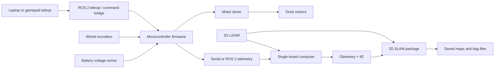

# RC Car SLAM Project Proposal

## Project Summary

Build a compact RC-car-style robot that can be driven manually while collecting the telemetry and sensor data needed for indoor SLAM. The project should begin as a reliable remote-controlled platform, then grow into a ROS 2 mapping system with odometry, transforms, LiDAR scans, bag capture, saved maps, and repeatable validation tests.

This Learn Robotics site is the planning and portfolio surface. The actual firmware, ROS 2 packages, launch files, CAD, hardware logs, and experiments should live in a separate implementation repository.

## Goal

Create a small mobile robot that can:

- Drive safely under manual control.
- Stop automatically when command input is lost.
- Report battery, command, PWM, encoder, and fault telemetry.
- Publish odometry and transforms into ROS 2.
- Capture 2D LiDAR data with consistent timestamps and frame names.
- Produce a saved map of a small indoor space.
- Repeat localization or mapping runs well enough to compare failures.

## Non-Goals

- Full outdoor autonomy in the first revision.
- High-speed RC driving while mapping.
- Computer vision SLAM before wheel odometry and 2D LiDAR are stable.
- Mixing site content, planning notes, and implementation source into one repo.

## Repository Boundary

| Surface | Owns | Does not own |
|---|---|---|
| Learn Robotics site | Proposal, milestone plan, architecture notes, demo writeups, stable lessons, final links | Firmware, ROS 2 code, bag files, raw logs, issue tracking |
| Implementation repo | Source code, hardware bring-up notes, experiment scripts, launch files, bags, maps, CAD, BOM revisions | General curriculum site content |

Promotion rule: only move lessons from the implementation repo back to this site after a milestone produces a useful demo, measurement, or postmortem.

## Recommended Scope

Start with a slow, stable indoor platform. A differential-drive rover chassis is easier for first SLAM experiments because velocity commands, odometry, and ROS 2 navigation assumptions are straightforward. An Ackermann RC car is more faithful to hobby RC hardware, but it adds steering geometry, larger turn radii, and more complicated odometry.

Default recommendation: differential drive first, Ackermann as a later comparison project.

## System Architecture

## Hardware Plan

| Subsystem | Starter choice | Reason |
|---|---|---|
| Chassis | Differential-drive rover or slow RC platform | Stable, serviceable base for indoor mapping |
| Low-level controller | Microcontroller with PWM, encoder inputs, watchdog loop | Keeps motor timing and safety close to hardware |
| High-level computer | Raspberry Pi-class Linux board | Runs ROS 2, LiDAR driver, bag capture, and SLAM |
| Motor driver | Dual H-bridge sized for stall current | Prevents brownouts and thermal shutdowns |
| Sensing | Wheel encoders, battery voltage, optional IMU | Establishes odometry before SLAM |
| SLAM sensor | 2D LiDAR | Simple, proven input for indoor 2D mapping |
| Power | Separate motor and logic regulation with shared ground strategy | Reduces resets and sensor corruption |

## Software Plan

### Phase 1: Safe RC Base

Outcome: manual driving is boring, repeatable, and easy to stop.

Tasks:

- Implement motor PWM and direction control.
- Add command parser for throttle, turn, mode, and timestamp.
- Add watchdog timeout to stop motors when commands expire.
- Add speed-limit mode for early tests.
- Log command, PWM, encoder counts, battery voltage, and fault state.

Checkpoint: the car can drive a 2 m indoor path five times and stop safely every time.

### Phase 2: Odometry and Telemetry

Outcome: the car reports motion data that can be plotted and compared.

Tasks:

- Read encoders reliably at expected motor speeds.
- Convert ticks to wheel distance and body motion.
- Run repeated straight-line and turn-in-place tests.
- Estimate drift, slip, and repeatability.
- Document calibration constants.

Checkpoint: odometry error is measured clearly enough to decide whether the base is ready for mapping.

### Phase 3: ROS 2 Bridge

Outcome: the robot can participate in a ROS 2 graph.

Tasks:

- Create a serial or network bridge between the microcontroller and ROS 2 computer.
- Publish odometry, battery state, and diagnostic topics.
- Subscribe to velocity commands.
- Publish transforms with consistent frame names.
- Add launch files for teleop, bridge, and visualization.

Checkpoint: RViz shows robot pose, odometry, and transforms while teleop commands move the base.

### Phase 4: LiDAR and SLAM

Outcome: the robot can create and save a small indoor map.

Tasks:

- Mount LiDAR rigidly and document the sensor frame.
- Publish scans with stable timestamps.
- Record rosbag data from teleop runs.
- Run SLAM Toolbox or an equivalent 2D SLAM package.
- Save maps and screenshots from repeated runs.

Checkpoint: the robot produces a usable map of one small indoor loop and the writeup explains map defects.

## Validation Plan

- Bench-test one motor channel before mounting motors.
- Run wheels-off-ground tests before every floor test after wiring changes.
- Measure battery voltage at rest, acceleration, and after five minutes.
- Record repeated 1 m straight drives.
- Record repeated 90 degree turns.
- Compare commanded motion, encoder odometry, and observed motion.
- Capture bag files for at least one successful and one failed mapping run.
- Keep manual teleop and emergency stop available during every SLAM test.

## Risks and Mitigations

| Risk | Symptom | Mitigation |
|---|---|---|
| Too much chassis speed | Unsafe indoor tests, blurry maps, collisions | Firmware speed limits and slow mapping mode |
| Poor odometry | Warped maps, localization jumps | Encoder calibration, lower speed, better wheel traction |
| Power noise | Controller resets, LiDAR disconnects, bad telemetry | Separate regulation, decoupling, wiring cleanup |
| Loose sensor mount | Map shifts when robot turns | Rigid mast and documented frame transform |
| Scope creep | Buying sensors before the base works | Manual RC first, odometry second, SLAM third |
| Repo confusion | Site becomes cluttered with raw logs and source | Keep implementation repo as the working lab |

## Deliverables

- Proposal page on Learn Robotics.
- Implementation repo link once created.
- Architecture diagram.
- Bill of materials and wiring diagram.
- Firmware for safe teleop and telemetry.
- ROS 2 bridge package and launch files.
- Odometry calibration report.
- Saved map files and screenshots.
- Demo video or GIF.
- Postmortem with failures, fixes, and next upgrades.

## Open Decisions

- Differential-drive rover chassis or Ackermann-style RC car?
- 2D LiDAR first, or depth camera later?
- Microcontroller plus Raspberry Pi, or a single integrated robotics controller?
- Indoor hallway mapping only, or eventual garage/outdoor testing?
- Public implementation repo from day one, or private until first working milestone?
